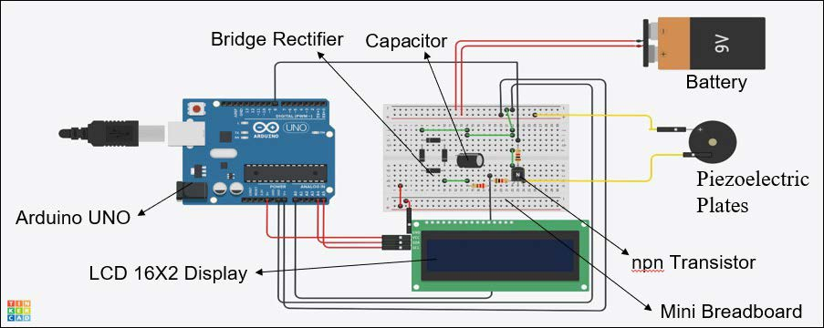
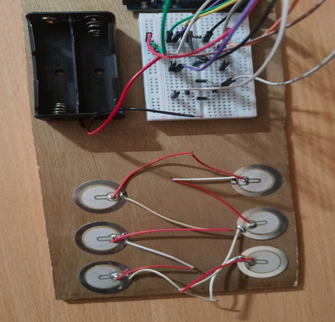
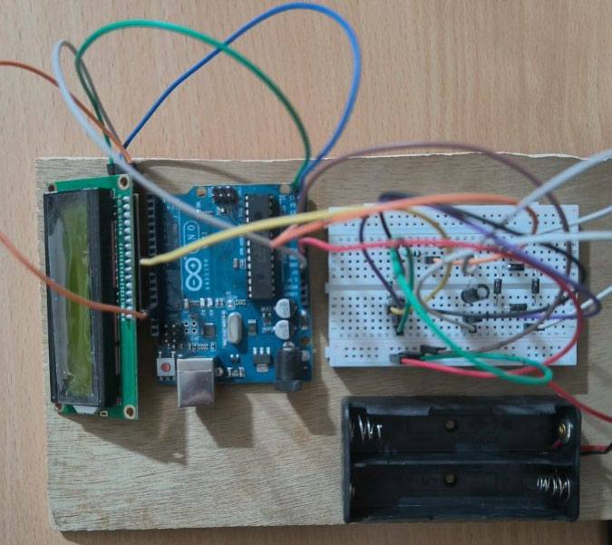

# ⚡ Piezoelectric Energy Floor – Footstep Power Prototype  

This project is a prototype piezoelectric energy floor that converts footsteps into small amounts of electrical energy. Pressure on the tile compresses piezoelectric plates, generating electricity that is rectified, stored, and used to power low‑power loads like LEDs to demonstrate the concept of footstep‑based energy harvesting.  

---

## 🚀 Features  

- Prototype floor tile with embedded piezoelectric plates  
- Generates voltage when a person steps on the tile  
- AC to DC conversion using a rectifier circuit  
- Energy storage using a capacitor or small rechargeable battery  
- Powers LEDs to visualize the generated energy in real time  
- Designed as a second‑year engineering proof‑of‑concept, not a full‑scale product  

---

## 🧰 Components Used  

- Piezoelectric plates (number as per design)  
- Full‑bridge rectifier (diodes or bridge module)  
- Capacitor and/or rechargeable battery  
- Voltage regulator/booster module (if used)  
- LEDs (or similar low‑power load)  
- Wires, connectors, PCB/breadboard  
- Mechanical floor tile/platform for mounting  

---

## 📝 Circuit Overview  

| Block               | Description                                      |
|---------------------|--------------------------------------------------|
| Piezo Plates        | Generate AC voltage from footstep pressure       |
| Rectifier           | Converts AC output from plates to DC             |
| Filter / Storage    | Capacitor/battery to smooth and store energy     |
| Load (LEDs, etc.)   | Uses the stored energy for visual indication     |

---

## 🧠 Working Principle  

- When a person steps on the tile, mechanical stress is applied to the piezoelectric plates.  
- Due to the piezoelectric effect, this stress produces an alternating voltage at the output of the plates.  
- The rectifier converts this AC voltage into DC, which is then smoothed and stored in a capacitor or battery.  
- The stored energy is used to power LEDs or other small loads, demonstrating that human footsteps can be used as a micro energy source.  

---

## 🧪 Result  

This prototype demonstrates:  

- Successful generation of measurable voltage from footsteps  
- Visible LED glow or output under repeated steps or higher pressure  
- Increased output with more plates or higher footfall on the tile  

> Note: The prototype is intended for educational and demonstration purposes. The power output is low and not meant for large‑scale real‑world deployment yet.  

---
## 📸 Prototype & Circuit Images

  <strong>Block Diagram</strong> 
  

  <strong>Circuit Schematic</strong> 
  

<table>
  <tr>
    <td align="center" style="padding: 10px;">
      <strong>Breadboard Prototype</strong> 
      
    </td>
    <td align="center" style="padding: 10px;">
      <strong>Mounted on Wooden Base</strong> 
      
    </td>
  </tr>
</table>

  <strong>Full Tile with Piezo Plates</strong> 
  

---

## 📌 Applications

- Smart corridors and walkways in colleges and malls  
- Awareness installations for renewable and sustainable energy  
- Low‑power IoT sensor powering in high‑footfall zones  
- Educational demos for energy harvesting and green technology  

---

## 📈 Future Scope  

- Use higher‑efficiency piezoelectric materials and optimized mechanical design  
- Scale the system with more tiles and better energy management circuits  
- Integrate data logging and IoT to monitor footfall and energy generated  
- Combine with other renewable sources (solar, etc.) for hybrid micro‑grids  

---

## 🧑‍💻 Author  

**Vansh Thakur**  
B.Tech CSE (Core)  
Chitkara University, Punjab  

---

### 📂 License  

This project is open‑source and can be used for learning and experimentation. Add a formal license (e.g., MIT) as `LICENSE` in the repository if required.
